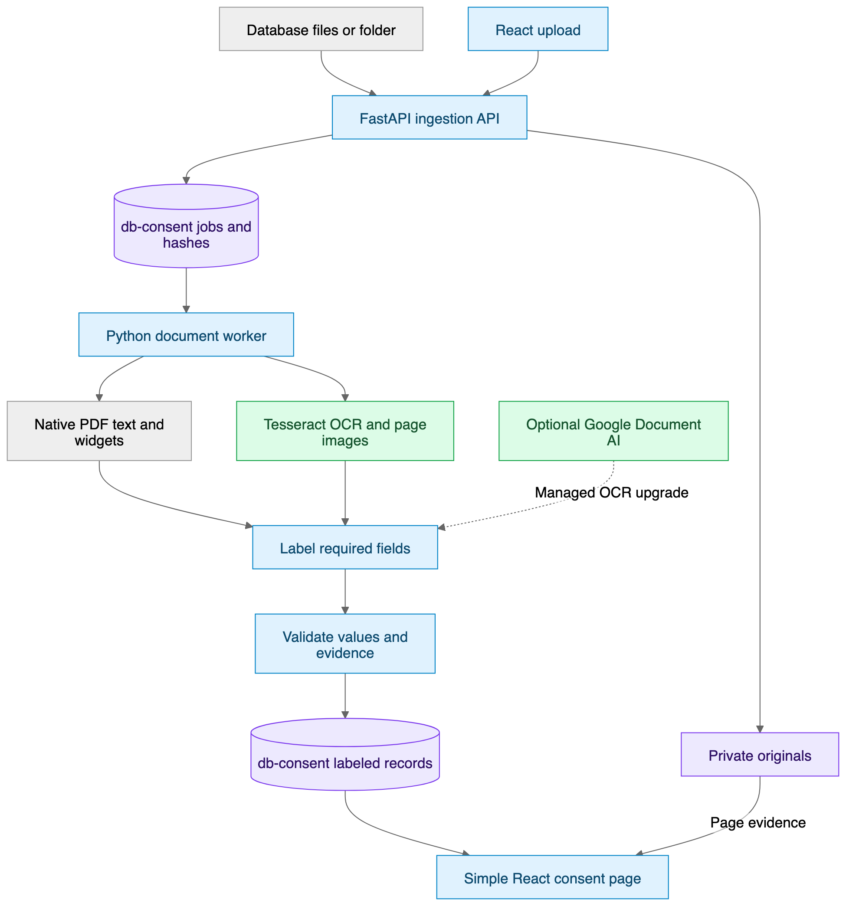

# OCR Consent Repository — MVP Architecture

Status: Implemented local MVP

[Mermaid source](../diagrams/ocr-data-pipeline.mmd) · [SVG](../diagrams/ocr-data-pipeline.svg) · [Editable Excalidraw](../diagrams/ocr-data-pipeline.excalidraw)

## Runtime components

| Component | Current implementation |
|---|---|
| React + TypeScript page | Upload up to five files, import a backend folder, list documents, show required fields and page evidence |
| FastAPI | Ingestion, list/detail APIs, reprocessing and protected page-image responses |
| Python worker | Native extraction, form-aware PDF rendering, pluggable OCR, categorization and database writes |
| `db-consent` | Local SQLite database for documents, hashes, runs, pages, fields, clauses and review metadata |
| Local private storage | Original files and rendered page images under `data/` |
| Managed OCR provider | Google Cloud Vision `DOCUMENT_TEXT_DETECTION`, with handwriting hints and regional endpoint support |

The React page is the simple PMP preview requested for this phase. It has no IDP, subject matching, withdrawal workflow or downstream consent action.

## Processing flow

1. Files arrive through multipart upload or a backend-accessible folder path.
2. The API verifies the extension and size, computes SHA-256 and rejects exact duplicates.
3. The original is copied under `data/originals/<document-id>.<extension>`.
4. A database job is marked `processing`.
5. PDF pages are inspected for embedded text and interactive widget values, then rendered with form appearances enabled.
6. The configured OCR provider reads every rendered page, including image-only documents. Google Vision is the active provider; DOCX text and embedded images use the same extraction boundary.
7. Rules label name, email, phone, consent text, consent choice, purpose, signature presence evidence, notice version and form version. Detected signature presence sets consent choice to `yes` with explicit rule provenance.
8. Every labeled value keeps its source page, evidence, confidence, missing reason and extraction method.
9. Results and detected clauses are saved transactionally, and the document becomes `completed / needs_review`.
10. The React page shows the stored fields beside the rendered source page.

## Local database model

| Table | Stored data |
|---|---|
| `documents` | UUID, filename, SHA-256, type, status, review state, page count, warnings and original path |
| `sources` | Upload/folder source reference and import time |
| `runs` | Processor name, processing state, start/finish time and error |
| `pages` | OCR/native text, method, confidence, PDF widgets and preview image path |
| `fields` | Required field, raw/normalized value, page, evidence, confidence, missing reason and provenance |
| `clauses` | Categorized consent, purpose, declaration, preference and product-instruction text |
| `review_history` | Reserved for later corrections and verification revisions |

UUIDs identify records. SHA-256 prevents duplicate file ingestion. Personal information is never used as a database key.

The JSON export maps these internal tables to schema version `1.0`. It includes source metadata, processing state, labeled fields, clauses, page-level OCR metadata and warnings. Local storage paths and internal row identifiers are not exported.

## API

- `GET /api/health`
- `POST /api/documents`
- `POST /api/import-folder`
- `POST /api/import-sqlite`
- `GET /api/documents`
- `GET /api/documents/{document_id}`
- `GET /api/documents/{document_id}/export`
- `POST /api/documents/{document_id}/process`
- `GET /api/documents/{document_id}/pages/{page_number}/image`

## Current extraction behavior

- Native PDF text and widget values are collected before categorization.
- OCR uses Google Cloud Vision when `OCR_PROVIDER=google-vision`; Tesseract 5 remains available locally.
- Blank or unreadable fields remain null with `not_present` or `ambiguous`.
- A line mentioning consent becomes a `Consent candidate`; it does not become a legal consent decision.
- A recognized signature area stays ambiguous until a non-empty PDF signature widget or OCR signature-presence rule supplies evidence. Detected presence sets consent choice to `yes` with `signature_consent_rule` provenance.
- Form versions remain separate from privacy notice versions.
- Every output remains `needs_review`.

## Provider configuration

The provider interface keeps the database and UI contract unchanged across Google Vision and Tesseract. Google calls use Application Default Credentials, support global, US or EU endpoints, and record their provenance in `runs.processor` and `pages.method`. The current source-database adapter reads BLOBs from SQLite in read-only mode; add the organization's actual database driver after its schema is known.

## Scaling boundary

SQLite and FastAPI background tasks are intentionally sufficient for the current pilot. Move to PostgreSQL, object storage and a durable external queue when source volume, concurrent workers or production recovery requirements justify them.
