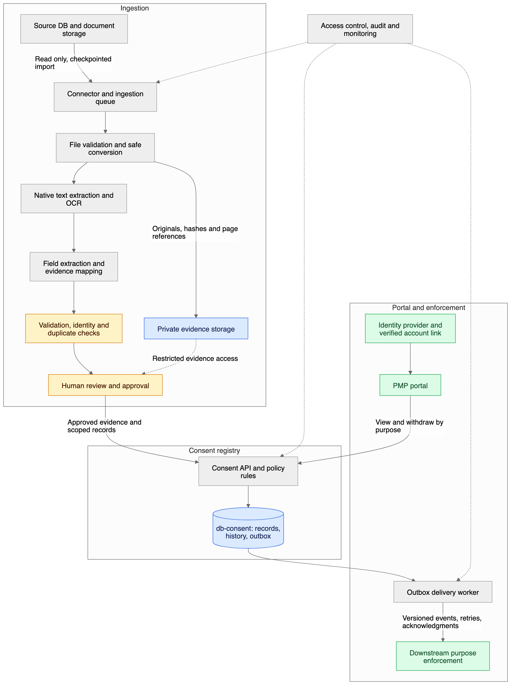

> Historical plan: superseded by the current OCR-to-database scope.

# Consent architecture

Status: Proposed logical architecture; stack and integration contracts await confirmation.



The editable source is [Mermaid](../../diagrams/consent-architecture.mmd). [SVG](../../diagrams/consent-architecture.svg), [PNG](../../diagrams/consent-architecture.png) and [editable Excalidraw](../../diagrams/consent-architecture.excalidraw) exports are included. Open the Excalidraw file using File → Open at excalidraw.com. The withdrawal sequence below is Mermaid-only; sequence diagrams are not supported by the editable flowchart converter.

## Boundaries and flow

1. **Source archive:** existing DB and associated document storage are read-only. Source rows may contain blobs or pointers; connector behavior follows the actual schema. Enumerate with a stable cursor/snapshot and record source updates as new versions.
2. **Ingestion:** save a manifest entry and idempotent job keyed by tenant/source/source ID/version. Fetch allowed locations with connector credentials, verify content and hash bytes. Record failed fetches and mutable-pointer changes.
3. **Evidence:** preserve originals with checksums and access controls; store derivatives separately. Apply retention to every copy. Shared pages can back multiple candidates without granting portal access to the whole page.
4. **Processing:** isolate conversion; extract native content from digital PDFs/DOCX, render pages as needed, OCR scans and embedded images, detect marks, group forms and retain coordinates. A single file may yield zero, one or many subject/purpose candidates.
5. **Resolution:** map raw wording to purpose/notice registries, validate fields, identify exact duplicates, suggest near-duplicates and resolve subject identity. Treat extracted values as proposals. First classify template/completion state and clause type; route service/product/declaration content separately from eligible privacy consent. Reconcile interactive PDF fields with form-aware rendering. The logical diagram’s extraction, validation and policy stages encompass these added responsibilities; component topology is unchanged.
6. **Review:** operators compare evidence and candidates; explicit approval creates canonical evidence-backed records. Missing mandatory evidence, conflicting identities and ambiguous choices remain held.
7. **Registry:** Consent API owns all effective-state mutations. `db-consent` stores approved records, current scoped state, history, review provenance and durable outbox entries. Staging records are never implicitly active.
8. **Portal:** existing PMP authenticates the subject and asks the API for their current scopes and history. A withdrawal commits locally before a receipt is returned. The API authorizes both principal/representative scope and policy eligibility; document roles alone cannot grant access. Non-consent banking instructions do not use the withdrawal endpoint.
9. **Enforcement:** delivery workers publish withdrawal/state events; dependent systems deduplicate, apply revisions and acknowledge. Operators reconcile authoritative state against consumers and repair lag.

## Proposed logical data model

| Entity | Key relationships and responsibility |
|---|---|
| source_item / ingestion_job | Tenant/source/version, checkpoint, status, attempts and error; links to document |
| document / document_source | UUID, byte hash, MIME, private URI and provenance; multiple source items can reference identical bytes |
| extraction_run / field_evidence | Document, processor versions, raw and normalized fields, confidence, page/region/native anchors |
| candidate / review_decision | Proposed subject/purpose/choice, independent workflow status, reviewer and reason |
| subject / identity_link | Stable UUID plus trusted external customer/PMP ID, verification method and provenance |
| document_template / clause_policy | Template family, printed form revision, layout/widget mappings and approved clause classification/withdrawal eligibility; versioned independently from notices |
| party / party_role / authority_link | Person/organization, document/application/account relationship, contact ownership, actor and independently verified representative authority |
| purpose / notice_version | Controlled definitions, controller, immutable notice text/hash and version history |
| consent_record / consent_evidence | UUID for each approved historical decision; subject, purpose, notice, channel and supporting evidence |
| consent_scope_state | Current effective state per tenant/controller/subject/purpose/channel; active record, revision and suppression watermark |
| consent_event | Append-only lifecycle events with actor, origin, occurrence/recording timestamps and reason |
| outbox / delivery_attempt | Event payload, consumer destination, attempt, status, retry time and acknowledgment |
| audit_event | Restricted record of processing, access, correction, merge and administrative actions |

Use UUIDs for jobs, documents, subjects, candidates, consent records, events and withdrawal receipts. Hashes identify content; they do not replace record IDs. Apply unique constraints to import idempotency keys and effective scope rows. Duplicate bytes never authorize merging people across tenants.

## State and conflict rules

Keep three independent dimensions:

- Processing: discovered → fetched → extracted → validated → review → published; with quarantined/failed/rejected exits.
- Extracted choice: granted / declined / unknown / ambiguous.
- Effective scope: active / withdrawn / expired / superseded, or no approved permission. A reviewed refusal is preserved without becoming active.

Paper event time and system import time are separate. Partial dates retain precision. When chronological ordering cannot be justified, flag a conflict; never apply last-import-wins. Withdrawal applies at purpose/channel scope across historical notice versions. Scope changes after withdrawal require a distinct verified re-consent event under a future approved workflow.

## Withdrawal transaction

```mermaid
sequenceDiagram
  participant U as User in PMP
  participant A as Consent API
  participant D as db-consent
  participant W as Delivery worker
  participant C as Downstream consumer
  U->>A: Withdraw authorized scope(s), idempotency key
  A->>D: Lock scope(s); write withdrawal, suppression, revision and outbox
  D-->>A: Transaction committed
  A-->>U: Receipt; state withdrawn
  W->>D: Read pending outbox event
  W->>C: Versioned withdrawal event
  C-->>W: Acknowledge applied revision
  W->>D: Record delivery outcome
```

Use per-scope serialization or optimistic concurrency with conflict retries for publication and withdrawal. The same transaction checks existing suppression before activating an imported grant. A failed transaction returns no success receipt. A successful transaction with later delivery failure remains withdrawn and retries delivery.

For consumers, persist deduplication and the applied revision atomically with local state; discard stale events. Reconciliation queries or snapshots repair missed events. Systems making processing decisions should consult authoritative state when practical; cached decisions need an agreed maximum age and fail-closed handling for unknown/stale consent. Already queued campaigns/work must cancel or recheck consent before execution. The 60-second delivery target is a proposed technical goal, not a legal grace period.

## Operating model and boundaries

Start with a modular API/admin backend and independent queue workers. A relational registry makes scope uniqueness and withdrawal/outbox transactions explicit; PostgreSQL is an option, not a selected dependency. Use private object storage for file bytes rather than large documents in registry rows. Existing infrastructure may satisfy these roles.

Monitor imports/pages, queue age, parse failures, review backlog, approval/correction rates, duplicate conflicts, cost/page, API latency, withdrawal-to-ack delay and stale consumers. Alerts must identify a responsible operator. Establish backup/restore and replay procedures with proposed RPO ≤15 minutes and RTO ≤4 hours, subject to infrastructure/cost approval. After restoration, reconcile later withdrawal events and downstream suppression before permitting active decisions; never blindly replay old active state.

Before rollout, name every downstream system and agree how it stops the relevant processing. A portal-only withdrawal is an incomplete delivery of this product.

## Sample-driven requirements

See [sample assessment](../SAMPLE-ASSESSMENT.md) for the six inspected templates. Incomplete/template input produces evidence and classification records without active consent. Form fingerprints identify layouts, not duplicate customers: shared boilerplate must not merge different completed applications. Preserve clause evidence across pages, including the loan declaration on pp5–6 and MSME party-table continuation on pp1–2. Widget-aware rendering is mandatory for corporate and fixed-deposit PDFs.
